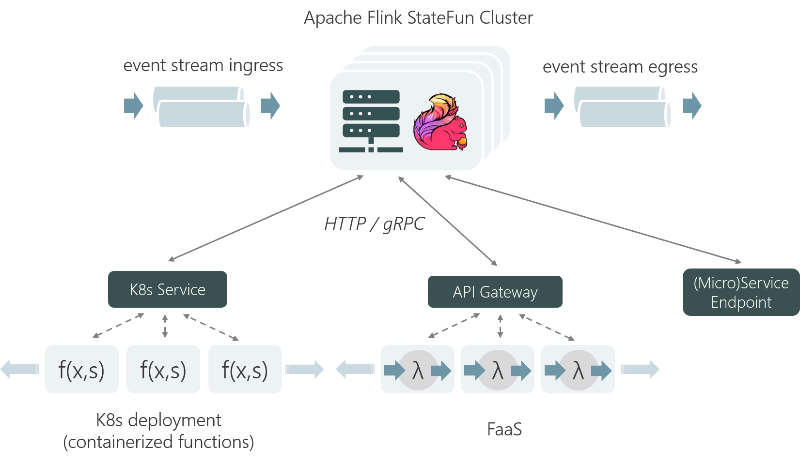

Stateful Functions is an [Apache Flink](https://flink.apache.org/) library that **simplifies building distributed stateful applications**. It's based on functions with persistent state that can interact dynamically with strong consistency guarantees.

Stateful Functions makes it possible to combine a powerful approach to state and composition with the elasticity, rapid scaling/scale-to-zero and rolling upgrade capabilities of FaaS implementations like AWS Lambda and modern resource orchestration frameworks like Kubernetes. With these features, it addresses [two of the most cited shortcomings](https://www2.eecs.berkeley.edu/Pubs/TechRpts/2019/EECS-2019-3.pdf) of many FaaS setups today: consistent state and efficient messaging between functions.

This README is meant as a brief walkthrough on the core concepts and how to set things up
to get yourself started with Stateful Functions.

For a fully detailed documentation, please visit the [official docs](https://ci.apache.org/projects/flink/flink-statefun-docs-master).

For code examples, please take a look at the [examples](statefun-examples/).

[](https://travis-ci.org/apache/flink-statefun)

## Table of Contents

- [Core Concepts](#core-concepts)
   * [Abstraction](#abstraction)
   * [Function modules and extensibility](#modules)
   * [Runtime](#runtime)
- [Getting Started](#getting-started)
   * [Running a full example](#greeter)
   * [Project setup](#project-setup)
   * [Building the Project](#build)
   * [Running in the IDE](#ide-harness)
- [Deploying Applications](#deploying)
   * [Deploying with a Docker image](#docker)
   * [Deploying as a Flink job](#flink)
- [Contributing](#contributing)
- [License](#license)

## <a name="core-concepts"></a>Core Concepts

### <a name="abstraction"></a>Abstraction

A Stateful Functions application consists of the following primitives: stateful functions, ingresses,
routers and egresses.

<p align="center">
  
</p>

#### Stateful functions

* A _stateful function_ is a small piece of logic/code that is invoked through a message. Each stateful function 
exists as a uniquely invokable _virtual instance_ of a _function type_. Each instance is addressed by its ``type``, as well as an unique ``ID`` (a string) within its type.

* Stateful functions may be invoked from ingresses or any other stateful function (including itself).
The caller simply needs to know the address of the target function.

* Function instances are _virtual_, because they are not all active in memory at the same time.
At any point in time, only a small set of functions and their state exists as actual objects. When a
virtual instance receives a message, one of the objects is configured and loaded with the state of that virtual
instance and then processes the message. Similar to virtual memory, the state of many functions might be “swapped out”
at any point in time.

* Each virtual instance of a function has its own state, which can be accessed in local variables.
That state is private and local to that instance.

If you know Apache Flink’s DataStream API, you can think of stateful functions a bit like a lightweight
`KeyedProcessFunction`. The function ``type`` is the process function transformation, while the ``ID`` is the key. The difference
is that functions are not assembled in a Directed Acyclic Graph (DAG) that defines the flow of data (the streaming topology),
but rather send events arbitrarily to all other functions using addresses.

#### Ingresses and Egresses

* _Ingresses_ are the way that events initially arrive in a Stateful Functions application.
Ingresses can be message queues, logs or HTTP servers — anything that produces an event to be
handled by the application.

* _Routers_ are attached to ingresses to determine which function instance should handle an event initially.

* _Egresses_ are a way to send events out from the application in a standardized way.
Egresses are optional; it is also possible that no events leave the application and functions sink events or
directly make calls to other applications.

### <a name="modules"></a>Modules

A _module_ is the entry point for adding the core building block primitives to a Stateful Functions
application, i.e. ingresses, egresses, routers and stateful functions.

A single application may be a combination of multiple modules, each contributing a part of the whole application.
This allows different parts of the application to be contributed by different modules; for example,
one module may provide ingresses and egresses, while other modules may individually contribute specific parts of the
business logic as stateful functions. This facilitates working in independent teams, but still deploying
into the same larger application.

## <a name="runtime">Runtime

The Stateful Functions runtime is designed to provide a set of properties similar to what characterizes [serverless functions](https://martinfowler.com/articles/serverless.html), but applied to stateful problems.

<p align="center">
  
</p>

The runtime is built on Apache Flink<sup>®</sup>, with the following design principles:

* **Logical Compute/State Co-location:** Messaging, state access/updates and function invocations are managed tightly together. This ensures a high-level of consistency out-of-the-box.

* **Physical Compute/State Separation:** Functions can be executed remotely, with message and state access provided as part of the invocation request. This way, functions can be managed like stateless processes and support rapid scaling, rolling upgrades and other common operational patterns.

* **Language Independence:** Function invocations use a simple HTTP/gRPC-based protocol so that Functions can be easily implemented in various languages.

This makes it possible to execute functions on a Kubernetes deployment, a FaaS platform or behind a (micro)service, while providing consistent state and lightweight messaging between functions.

## <a name="getting-started"></a>Getting Started

Follow the steps here to get started right away with Stateful Functions.

This guide will walk you through setting up to
start developing and testing your own Stateful Functions (Java) application, and running an existing example. If you prefer to get started with Python, have a look into the [StateFun Python SDK](https://github.com/apache/flink-statefun/tree/master/statefun-python-sdk) and the [Python Greeter example](https://github.com/apache/flink-statefun/tree/master/statefun-examples/statefun-python-greeter-example).

### <a name="project-setup"></a>Project Setup

Prerequisites:

* Docker

* Maven 3.5.x or above 

* Java 8 or above

You can quickly get started building Stateful Functions applications using the provided quickstart Maven archetype:

```
mvn archetype:generate \
  -DarchetypeGroupId=org.apache.flink \
  -DarchetypeArtifactId=statefun-quickstart \
  -DarchetypeVersion=2.1-SNAPSHOT
```

This allows you to name your newly created project. It will interactively ask you for the `GroupId`,
`ArtifactId` and package name. There will be a new directory with the same name as your `ArtifactId`.

We recommend you import this project into your IDE to develop and test it.
IntelliJ IDEA supports Maven projects out of the box. If you use Eclipse, the `m2e` plugin allows to import
Maven projects. Some Eclipse bundles include that plugin by default, others require you to install it manually.

### <a name="build"></a>Building the Project

If you want to build/package your project, go to your project directory and run the `mvn clean package` command. You will find a JAR file that contains your application, plus any libraries that you may have added as dependencies to the application: `target/<artifact-id>-<version>.jar`.

### <a name="ide-harness"></a>Running from the IDE

To test out your application, you can directly run it in the IDE without any further packaging or deployments.

Please see the [Harness example](statefun-examples/statefun-flink-harness-example) on how to do that.

### <a name="greeter"></a>Running a full example

As a simple demonstration, we will be going through the steps to run the [Greeter example](statefun-examples/statefun-greeter-example).

Before anything else, make sure that you have locally [built the project as well as the base Stateful Functions Docker image](#build).
Then, follow the next steps to run the example:

```
cd statefun-examples/statefun-greeter-example
docker-compose build
docker-compose up
```

This example contains a very basic stateful function with a Kafka ingress and a Kafka egress.

To see the example in action, send some messages to the topic `names`, and see what comes out out of the topic `greetings`:

```
docker-compose exec kafka-broker kafka-console-producer.sh \
     --broker-list localhost:9092 \
     --topic names
```

```
docker-compose exec kafka-broker kafka-console-consumer.sh \
     --bootstrap-server localhost:9092 \
     --isolation-level read_committed \
     --from-beginning \
     --topic greetings 
```

## <a name="deploying"></a>Deploying Applications

Stateful Functions applications can be packaged as either [standalone applications](https://ci.apache.org/projects/flink/flink-statefun-docs-master/deployment-and-operations/packaging.html#images) or [Flink jobs](https://ci.apache.org/projects/flink/flink-statefun-docs-master/deployment-and-operations/packaging.html#flink-jar) that can be
submitted to a Flink cluster.

### <a name="docker"></a>Deploying with a Docker image

Below is an example Dockerfile for building a Stateful Functions image with an [embedded](https://ci.apache.org/projects/flink/flink-statefun-docs-master/sdk/modules.html#embedded-module) module (Java) for an application called `statefun-example`.

```
FROM flink-statefun[:version-tag]

RUN mkdir -p /opt/statefun/modules/statefun-example

COPY target/statefun-example*jar /opt/statefun/modules/statefun-example/
```

### <a name="flink"></a>Deploying as a Flink job

If you prefer to package your Stateful Functions application as a Flink job to submit to an existing Flink cluster,
simply include `statefun-flink-distribution` as a dependency to your application.

```
<dependency>
    <groupId>org.apache.flink</groupId>
    <artifactId>statefun-flink-distribution</artifactId>
    <version>2.1-SNAPSHOT</version>
</dependency>
```

It includes all the runtime dependencies and configures the application's main entry-point.
You do not need to take any action beyond adding the dependency to your POM file.

<div class="alert alert-info">
  <strong>Attention:</strong> The distribution must be bundled in your application fat JAR so that it is on Flink's <a href="https://ci.apache.org/projects/flink/flink-docs-stable/monitoring/debugging_classloading.html#inverted-class-loading-and-classloader-resolution-order">user code class loader</a>
</div>

```
{$FLINK_DIR}/bin/flink run ./statefun-example.jar
```

## <a name="contributing"></a>Contributing

There are multiple ways to enhance the Stateful Functions API for different types of applications; the runtime and operations will also evolve with the developments in Apache Flink.

You can learn more about how to contribute in the [Apache Flink website](https://flink.apache.org/contributing/how-to-contribute.html). For code contributions, please read carefully the [Contributing Code](https://flink.apache.org/contributing/contribute-code.html) section and check the _Stateful Functions_ component in [Jira](https://issues.apache.org/jira/browse/FLINK-15969?jql=project%20%3D%20FLINK%20AND%20component%20%3D%20%22Stateful%20Functions%22) for an overview of ongoing community work.

## <a name="license"></a>License

The code in this repository is licensed under the [Apache Software License 2](LICENSE).