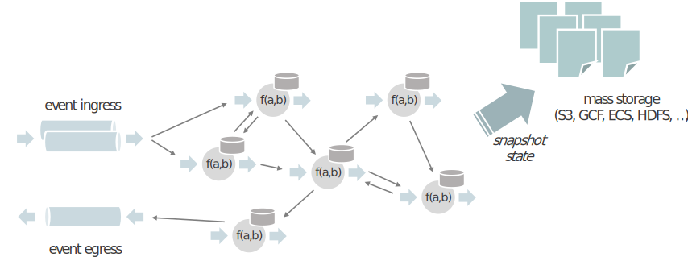

Stateful Functions is an API that simplifies the building of **distributed stateful applications** with a **runtime built for serverless architectures**.
It brings together the benefits of stateful stream processing - the processing of large datasets with low latency and bounded resource constraints -
along with a runtime for modeling stateful entities that supports location transparency, concurrency, scaling, and resiliency. 


It is designed to work with modern architectures, like cloud-native deployments and popular event-driven FaaS platforms 
like AWS Lambda and KNative, and to provide out-of-the-box consistent state and messaging while preserving the serverless
experience and elasticity of these platforms.

Stateful Functions is developed under the umbrella of [Apache Flink](https://flink.apache.org/).

This README is meant as a brief walkthrough on the core concepts and how to set things up
to get yourself started with Stateful Functions.

For a fully detailed documentation, please visit the [official docs](https://ci.apache.org/projects/flink/flink-statefun-docs-master).


## Table of Contents

- [Core Concepts](#core-concepts)
   * [Abstraction](#abstraction)
   * [Function modules and extensibility](#modules)
   * [Runtime](#runtime)
- [Getting Started](#getting-started)
   * [New Java Users](#java)
   * [New Python Users](#python)
- [Building the Project](#build)
   * [Prerequisites](#build-prerequisites)
   * [Procedures](#build-procedures)
- [Contributing](#contributing)
- [License](#license)

## <a name="core-concepts"></a>Core Concepts

### <a name="abstraction"></a>Abstraction

A Stateful Functions application consists of the following primitives: stateful functions, ingresses,
routers and egresses.

<p align="center">
  
</p>

#### Stateful functions

* A _stateful function_ is a small piece of logic/code that is invoked through a message. Each stateful function 
exists as a uniquely invokable _virtual instance_ of a _function type_. Each instance is addressed by its ``type``, as well as an unique ``ID`` (a string) within its type.

* Stateful functions may be invoked from ingresses or any other stateful function (including itself).
The caller simply needs to know the address of the target function.

* Function instances are _virtual_, because they are not all active in memory at the same time.
At any point in time, only a small set of functions and their state exists as actual objects. When a
virtual instance receives a message, one of the objects is configured and loaded with the state of that virtual
instance and then processes the message. Similar to virtual memory, the state of many functions might be “swapped out”
at any point in time.

* Each virtual instance of a function has its own state, which can be accessed in local variables.
That state is private and local to that instance.

If you know Apache Flink’s DataStream API, you can think of stateful functions a bit like a lightweight
`KeyedProcessFunction`. The function ``type`` is the process function transformation, while the ``ID`` is the key. The difference
is that functions are not assembled in a Directed Acyclic Graph (DAG) that defines the flow of data (the streaming topology),
but rather send events arbitrarily to all other functions using addresses.

#### Ingresses and Egresses

* _Ingresses_ are the way that events initially arrive in a Stateful Functions application.
Ingresses can be message queues, logs or HTTP servers — anything that produces an event to be
handled by the application.

* _Routers_ are attached to ingresses to determine which function instance should handle an event initially.

* _Egresses_ are a way to send events out from the application in a standardized way.
Egresses are optional; it is also possible that no events leave the application and functions sink events or
directly make calls to other applications.

### <a name="modules"></a>Modules

A _module_ is the entry point for adding the core building block primitives to a Stateful Functions
application, i.e. ingresses, egresses, routers and stateful functions.

A single application may be a combination of multiple modules, each contributing a part of the whole application.
This allows different parts of the application to be contributed by different modules; for example,
one module may provide ingresses and egresses, while other modules may individually contribute specific parts of the
business logic as stateful functions. This facilitates working in independent teams, but still deploying
into the same larger application.

## <a name="runtime">Runtime

The Stateful Functions runtime is designed to provide a set of properties similar to what characterizes [serverless functions](https://martinfowler.com/articles/serverless.html), but applied to stateful problems.

<p align="center">
  
</p>

The runtime is built on Apache Flink<sup>®</sup>, with the following design principles:

* **Logical Compute/State Co-location:** Messaging, state access/updates and function invocations are managed tightly together. This ensures a high-level of consistency out-of-the-box.

* **Physical Compute/State Separation:** Functions can be executed remotely, with message and state access provided as part of the invocation request. This way, functions can be managed like stateless processes and support rapid scaling, rolling upgrades and other common operational patterns.

* **Language Independence:** Function invocations use a simple HTTP/gRPC-based protocol so that Functions can be easily implemented in various languages.

This makes it possible to execute functions on a Kubernetes deployment, a FaaS platform or behind a (micro)service, while providing consistent state and lightweight messaging between functions.

## <a name="getting-started"></a>Getting Started

We highly recommend starting from the the tutorials and examples that can be found in the [Stateful Functions Playground repository](https://github.com/apache/flink-statefun-playground). There you will find material that serve as a great starting point if you've just started with getting to know the project, or looking for specific examples of common usage patterns.

### <a name="java">New Java Users

Head over to the [Java SDK Showcase](https://github.com/apache/flink-statefun-playground/tree/release-3.2/java/showcase), or the [Java Greeter Example](https://github.com/apache/flink-statefun-playground/tree/release-3.2/java/greeter) in the playground repository.

Alternatively, execute the following commands to clone the playground repository locally:
```
$ git clone -b release-3.2 https://github.com/apache/flink-statefun-playground.git
$ cd java/showcase # or, java/greeter
```

### <a name="python">New Python Users

For new Python users, head over to the [Python SDK Showcase](https://github.com/apache/flink-statefun-playground/tree/release-3.2/python/showcase), or the [Python Greeter Example](https://github.com/apache/flink-statefun-playground/tree/release-3.2/python/greeter) in the playground repository.

Alternatively, execute the following commands to clone the playground repository locally:
```
$ git clone -b release-3.2 https://github.com/apache/flink-statefun-playground.git
$ cd python/showcase # or, python/greeter
```

Each tutorial or example in the playground repository will have a `README` that contains details on building and running the code. Take a look and try it out yourself!

## <a name="build"></a>Building the Project

This section contains information for building this project.

### <a name="build-prerequisites">Prerequisites

- Maven v3.5+
- Java 8
- Docker v20.10+ (if you'd like to run the end-to-end tests as part of the build)

### <a name="build-procedures">Procedures

1. Build source code:
  ```
  $ mvn clean install
  $ # or, alternatively, run the end-to-end tests as well (requires Docker)
  $ mvn clean install -Prun-e2e-tests
  ```

2. Build Stateful Functions Docker image: This step requires that you've already compiled artifacts from the source code.
  ```
  $ ./tools/docker/build-stateful-functions.sh
  ```
  This builds a local Docker image tagged as `flink-statefun:<version_of_current_source_version>`.

## <a name="code-of-conduct"></a>Code of Conduct

Apache Flink, Stateful Functions, and all its associated repositories follow the [Code of Conduct of the Apache Software Foundation](https://www.apache.org/foundation/policies/conduct).

## <a name="license"></a>License

The code in this repository is licensed under the [Apache Software License 2.0](LICENSE).
