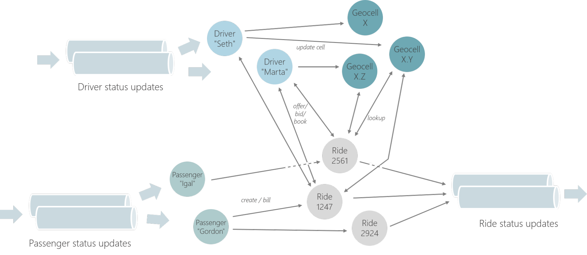

.. Copyright 2019 Ververica GmbH.

   Licensed under the Apache License, Version 2.0 (the "License");
   you may not use this file except in compliance with the License.
   You may obtain a copy of the License at

        http://www.apache.org/licenses/LICENSE-2.0

   Unless required by applicable law or agreed to in writing, software
   distributed under the License is distributed on an "AS IS" BASIS,
   WITHOUT WARRANTIES OR CONDITIONS OF ANY KIND, either express or implied.
   See the License for the specific language governing permissions and
   limitations under the License.

.. _stateful_functions:

##############################
Stateful Functions Abstraction
##############################

.. contents:: :local:

Stateful functions are the building blocks (and namesake) of the **Stateful Functions** framework. A function is a small piece of logic — currently, simple Java functions — that is invoked through a message. Applications are built from many functions that interact by sending each other messages.

.. image:: ../_static/images/example_ride_sharing.png
    :width: 85%
    :align: center

In many ways, stateful functions are comparable to actors or message-driven beans, but distinguish themselves through the following properties:

.. topic:: Virtual

	Stateful functions exist in virtual instances. Each type of function (like PassengerFunction, DriverFunction, RideFunction) exists in many instances, typically one per entity (here, one per passenger or driver or pending/ongoing ride). Each instance has a logical ``ID``. The ``type`` and ``ID`` together form the ``Address`` of that function.

For example, “Driver Seth”, “Passenger Gordon, or “Ride 2924" would be addresses.

.. topic:: Addressable

	Functions interact with each other by sending point-to-point messages to their ``Addresses``.

.. topic:: Stateful

	Each virtual instance of a function has its own state, which can be accessed in local variables. That state is private and local to that instance. State might be the status of a ride, the account information of a passenger or similar.

.. topic:: Lightweight

	Function instances are “virtual”, because they are not all active in memory at the same time. At any point in time, only a small set of functions and their state exists as actual objects. When a virtual instance receives a message, one of the objects is configured and loaded with the state of that virtual instance and then processes the message. Similar to virtual memory, the state of many functions might be “swapped out” at any point in time.

If you know Apache Flink’s DataStream API, you can think of stateful functions a bit like a lightweight ``KeyedProcessFunction``. The function ``type`` would then be equivalent to the process function transformation and logical ``ID`` to the key. The difference is that functions are not assembled in a DAG (Directed Acyclic Graph) that defines the flow of data — or, the streaming topology —, but rather send events arbitrarily to all other functions using their ``Addresses``.

Ingresses / Egresses
====================

``Ingresses`` are the way that events initially arrive in a **Stateful Functions** application. Ingresses can be message queues, logs, or HTTP servers — anything that produces an event to be handled by the application.

``Routers`` are attached to ingresses to determine which function instance should handle an event initially.

``Egresses`` are a way to send events out from the application in a standardized way. Egresses are optional; it is also possible that no events leave the application and functions sink events or directly make calls to other applications. Egresses are integrated with the state/messaging/consistency model and can help with sending responses in a fault-tolerant/consistent way.

Scaling and Resources
=====================

Applications are inherently scalable because virtual function instances are distributed across parallel processes or shards. Sharding is based on message ``type`` and ``ID``, so messages can be efficiently routed without additional name resolution.

Functions do not have dedicated resources, like threads or memory; all function types share the same resources. Each shard has a "dispatcher" that loads and invokes the target virtual instance of a message. Whenever a function is not executed, its state may reside outside memory. For example, in the implementation on top of Apache Flink, each shard keeps all function state in a local RocksDB instance, with “warm” state residing in the memory cache and “cold” state being evicted to disk.

State and Consistency Guarantees
================================
Within a **Stateful Functions** application, everything is inherently strongly consistent. By co-locating the state with the functions, and by integrating the state modifications and messaging, the system creates the effect of consistent state and reliable messaging within all interacting functions. Upon failure, the system rewinds the affected states and messages together to a consistent point and re-executes the messages.

Care about consistency needs to be taken when “interacting with the outside world” — or, any action that leaves the **Stateful Functions** application. Event Egresses support that interaction in a principled manner. Some egresses support transactional semantics, so that events are only made visible once it is certain that no rollback will occur any more.

Modules of Functions
====================
Applications are composed of ``Modules``. A module is the entry point for adding ingresses, egresses, routers, and stateful functions to an application. Functions added in one module can message functions from another module or listen to events from an ingress registered in another module.

The module system allows different parts of the application to be contributed by different developers; for example, one module may provide ingresses and egresses, while other modules may individually contribute specific parts of the business logic as stateful functions. This facilitates working in independent teams, but still deploying into the same larger application.
