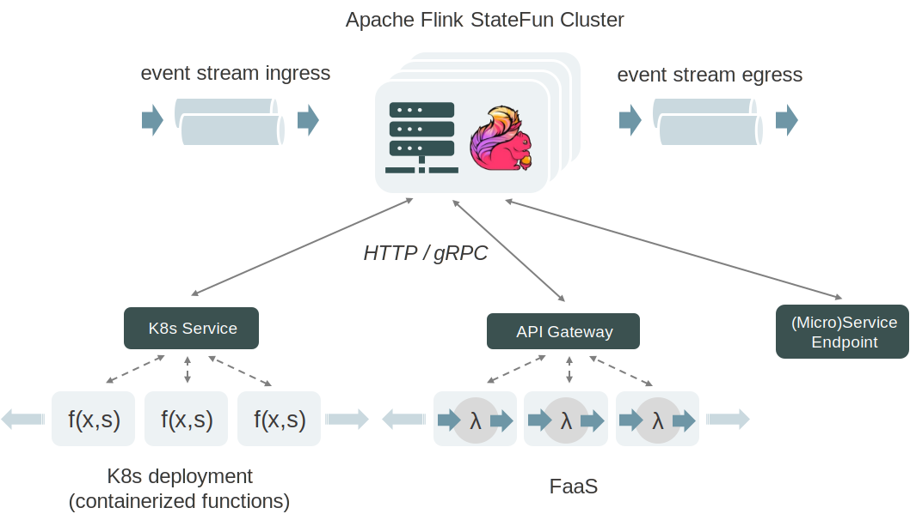

# Apache Flink Stateful Functions

Stateful Functions is an API that simplifies the building of **distributed stateful applications** with a **runtime built for serverless architectures**.
It brings together the benefits of stateful stream processing - the processing of large datasets with low latency and bounded resource constraints -
along with a runtime for modeling stateful entities that supports location transparency, concurrency, scaling, and resiliency. 



It is designed to work with modern architectures, like cloud-native deployments and popular event-driven FaaS platforms 
like AWS Lambda and KNative, and to provide out-of-the-box consistent state and messaging while preserving the serverless
experience and elasticity of these platforms.

Stateful Functions is developed under the umbrella of [Apache Flink](https://flink.apache.org/).

This README is meant as a brief walkthrough on the StateFun GoLang SDK and how to set things up
to get yourself started with Stateful Functions in GoLang.

For a fully detailed documentation, please visit the [official docs](https://ci.apache.org/projects/flink/flink-statefun-docs-master).

## Table of Contents

- [Python SDK Overview](#sdkoverview)
- [Contributing](#contributing)
- [License](#license)

## <a name="sdkoverview"></a> Golang SDK Overview

### Background

The JVM-based Stateful Functions implementation has a `RequestReply` extension (a protocol and an implementation) that allows calling into any HTTP endpoint that implements that protocol. Although it is possible to implement this protocol independently, this is a minimal library for the Python programing language that:

* Allows users to define and declare their functions in a convenient way.

* Dispatches an invocation request sent from the JVM to the appropriate function previously declared.

### A Mini-Tutorial

#### Define and Declare a Function

```
import (
	"context"
	"fmt"
	"github.com/apache/flink-statefun/statefun-go-sdk/v2/pkg/flink/statefun"
	"google.golang.org/protobuf/types/known/anypb"
	"http"
)

type Greeter struct {}

func (g Greeter) Invoke(ctx context.Context, runtime statefun.Output, msg *anypb.Any) error {
	fmt.Println("Hi %s", statefun.Self(ctx).Id)
}
```

This code declares a function by implementing the `statefun.StatefulFunction` interface.

#### Registering and accessing persisted state

You can register persistent state that will be managed by the Stateful Functions workers
for state consistency and fault-tolerance. The state values could be absent (`None` or a `google.protobuf.Any`) and
they can be obtained via the `statefun.State` objects in the functions implementing struct.

```
type Greeter struct {
    Session statefun.State `state:"session"`
}

func (g Greeter) Invoke(ctx context.Context, runtime statefun.Output, msg *anypb.Any) error {
	var session Session
    exists, _ := g.Session.Get(&session)

    if !exists {
        session = startSession(message)
        _ = g.Session.Set(&session)
    }

    ...
}
```

#### Expose with a Function Registry And Expose

```
func main() {
	registry := statefun.NewFunctionRegistry()
	if err := registry.RegisterFunction(statefun.FunctionType{
		Namespace: "demo",
		Type:      "greeter",
	}, &Greeter{}); err != nil {
		log.Fatalf("failed to register function %v", err)
	}

	http.Handle("/statefun", registry)
	_ = http.ListenAndServe(":8000", nil)
```

This creates an HTTP server that accepts requests from the Stateful Functions cluster and
dispatches it to the handler.

#### Composing the Module YAML File

The remaining step would be to declare this function type in a module.yaml

```
functions:
  - function:
    meta:
      kind: http
      type: demo/greeter
    spec:
      endpoint: http://<end point url>/statefun
```

### Testing

Execute the unit tests from within the `statefun-go-sdk` directory

```
go test ./...
```

## <a name="contributing"></a>Contributing

There are multiple ways to enhance the Stateful Functions API for different types of applications; the runtime and operations will also evolve with the developments in Apache Flink.

You can learn more about how to contribute in the [Apache Flink website](https://flink.apache.org/contributing/how-to-contribute.html). For code contributions, please read carefully the [Contributing Code](https://flink.apache.org/contributing/contribute-code.html) section and check the _Stateful Functions_ component in [Jira](https://issues.apache.org/jira/browse/FLINK-15969?jql=project%20%3D%20FLINK%20AND%20component%20%3D%20%22Stateful%20Functions%22) for an overview of ongoing community work.

## <a name="license"></a>License

The code in this repository is licensed under the [Apache Software License 2](LICENSE).
